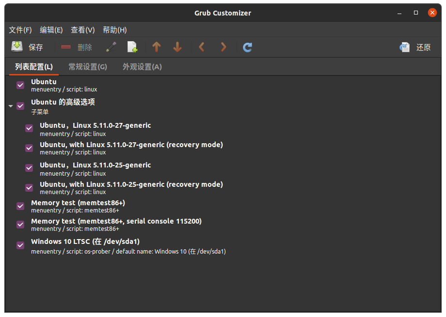
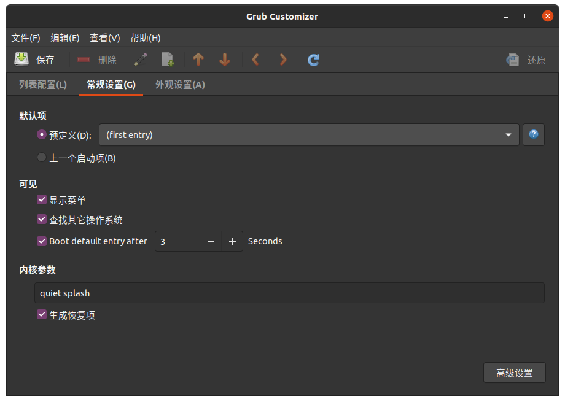
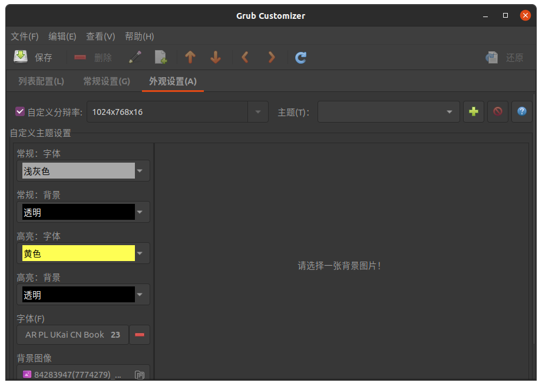

## 目录


- [Ubuntu常用命令(个人)](#常用命令)
- [关于Ubuntu20.04.2提示无法提供完整语言支持解决办法](#关于ubuntu20042提示无法提供完整语言支持解决办法)
    - [问题与原因](#问题与原因)
    - [解决方法1](#解决方法)
    - [解决方法2(推荐)](#更好的解决方法)
- [Ubuntu与Windows重复启动，启动项套娃](#ubuntu与windows重复启动启动项套娃)
    - [问题分析](#问题分析)
    - [解决方法](#将grub安装到mbr)

# 常用命令

此仅用于[个人]( "Ubuntu20.04")日常使用归纳

## su

超级用户，新安装的Ubuntu需设置su密码
```bash
$ sudo passwd  #设置su密码
$ su           #切换到超级用户
```

## 系统版本信息

1、
```bash
$ lsb_release -a
Distributor ID: Ubuntu    //类别是ubuntu
Description:    Ubuntu 20.04.3 LTS  //2020年2月4月发布的稳定版本，LTS是Long Term Support：长时间支持版本五年
Release:    20.04  //发行日期或者是发行版本号
Codename:   focal //ubuntu的代号名称
```
2、这个例子是Windows下Linux子系统信息，与一般Linux大体一致：Linux version为Linux内核版本号，gcc version为gcc编译器版本号，#后SMP前为Ubuntu版本号

```bash
$ cat /proc/version
Linux version 5.10.16.3-microsoft-standard-WSL2 (oe-user@oe-host) (x86_64-msft-linux-gcc (GCC) 9.3.0, GNU ld (GNU Binutils) 2.34.0.20200220) #1 SMP Fri Apr 2 22:23:49 UTC 2021
```
3、
```bash
$ uname -a
```

## 软件相关

### apt-get

```bash
$ sudo apt-get update   #更新索引文件
$ sudo apt-get upgrade  #更新已安装软件
$ sudo apt-get dist-upgrade  # ?
$ sudo apt-get autoremove (--purge)  #自动卸载不再依赖的软件包
$ sudo apt-get -f install  #修复依赖关系，可指定包名修复特定软件包依赖关系
$ sudo apt-get install
$ sudo apt-get remove (--purge)  #后面加软件包名字，卸载(包括配置文件)已安装软件包
$ apt search  #搜索软件包库
$ sudo apt-get autoclean  #清理过时的存档文件(archive files)
$ sudo apt-get clean  #移除所有的存档文件(archive files)
$ sudo rm -rf /var/lib/apt/lists/*  #清理下载的索引文件
$ sudo du -sh /var/cache/apt  #检查当前 APT 缓存文件的使用率
$ du -sh ~/.cache/thumbnails/  #检查当前 APT 缓存的利用率
```
有时apt-get update会出现md5不对应的错误，这是官方未修改完全导致的，过一段时间(几天)就恢复正常，很多人嫌官方源下载慢，要换源，但很可能导致错误，不建议，老老实实等就行了，不用那么折腾，没准以后还要再换回官方源

关于apt-get remove使用经验，如何知道软件名称，图形界面中可以使用系统监视器选择我的进程，查看想卸载且正在运行的软件，[如]( "ubuntu20.04")：扫雷(gnome-mines),数独(gnome-sudoku),对对碰(gnome-mahjongg),aisleriot 接龙(aisleriot),视频(totem),火狐(firefox),启动盘创建器(usb-creator-gtk),文档查看器(evince),文档扫描仪(simple-scan),remmina,rhythmbox,transmission-gtk,shotwell,thunderbird,Ubuntu Software(snapd),茄子(cheese),帮助(yelp)

个别软件监视器监测不到，如livepatch只是抽屉的快捷方式，卸载方法未知，删除快捷方式方法：

```bash
$ sudo rm /usr/share/applications/software-properties-livepatch.desktop
```
还有aisleriot不知道为什么监测不到，但是不影响卸载

### dpkg

用于安装下载的deb包
```bash
$ tar -zxvf *.tar.gz  #解压下载的tar.gz压缩包，或者用归档管理器解压
$ sudo dpkg -i  #后面需指定deb文件名
$ sudo dpkg -i *.deb  #安装当前目录下所有的deb包
```

### snapd

官宣很nb，安装的应用运行在隔离环境，极致安全。目前难用，有墙
```bash
$ snap login
$ snap logout
$ snap whoami
$ snap search
$ snap find
$ snap install
$ snap remove (--purge)
$ snap list
```

## 文件(夹)操作
```bash
$ cd  #进入目录
$ .    #当前目录
$ ..   #上级目录
$ pwd  #显示当前目录
$ echo  #在终端输出文字
$ cat  #输出文本内容
$ ls (-a)  #列出目录下文件与文件夹
$ ls (-l)  #列出目录下文件与文件夹(逐行显示详细信息)
$ chmod    #将每个文件的权限模式变更至指定模式
$ info     #
```
关于chmod更多请参考[chmod --hlep](https://github.com/sjh0020/ubuntu/biob/master/help.md/#chmod)

## 磁盘操作

```bash
$ df -h  #检查当前磁盘利用率
$ mount  #挂载
$ fdisk  #磁盘操作
$ clear  #清屏
```

## 网络

```bash
$ ifconfig  #查看网络信息
最左边为网卡名，如eth0
inet为这个网卡分配的ip地址
netmask为子网掩码
$ route -n
Gateway  #网关地址
Genmask  #子网掩码
Iface   #网卡名称
```

## 其他

```bash
$ clear  #清屏
$ exit   #退出bash/终端
$ type   #显示指定命令为内部命令或外部命令，内部命令则显示路径
```

# 关于Ubuntu20.04.2提示无法提供完整语言支持解决办法

## 问题与原因

确定下载文件后提示依赖关系不正确
看了很多教程都没什么用，作为Ubuntu的小白，尝试打开终端按照在提示下载页中展开详细，逐个apt安装，发现是前缀为libreoffice的软件的报错，而且用sudo apt-get -f install liberoffice提示无法修正，原因是apt中的libreoffice为6.4.7，版本过于古老，目前最新版本为7.2


## 解决方法：

### 安装libreoffice

找对方向后在[Libreoffice官方国内镜像下载](https://mirrors.cloud.tencent.com/libreoffice/libreoffice/stable/)下载对应想安装的版本，这里我选择了[7.2.0/deb/x86_64](https://mirrors.cloud.tencent.com/libreoffice/libreoffice/stable/7.2.0/deb/x86_64/ "Libreoffice7.2.0")，下载3个文件：
[LibreOffice_7.2.0_Linux_x86-64_deb.tar.gz](https://mirrors.cloud.tencent.com/libreoffice/libreoffice/stable/7.2.0/deb/x86_64/LibreOffice_7.2.0_Linux_x86-64_deb.tar.gz "主体文件")           

[LibreOffice_7.2.0_Linux_x86-64_deb_helppack_zh-CN.tar.gz](https://mirrors.cloud.tencent.com/libreoffice/libreoffice/stable/7.2.0/deb/x86_64/LibreOffice_7.2.0_Linux_x86-64_deb_helppack_zh-CN.tar.gz "离线帮助文档")    

[LibreOffice_7.2.0_Linux_x86-64_deb_langpack_zh-CN.tar.gz](https://mirrors.cloud.tencent.com/libreoffice/libreoffice/stable/7.2.0/deb/x86_64/LibreOffice_7.2.0_Linux_x86-64_deb_langpack_zh-CN.tar.gz "语言支持")

然后解压

或者在终端输入代码：

```bash
$ wget -c https://mirrors.cloud.tencent.com/libreoffice/libreoffice/stable/7.2.0/deb/x86_64/LibreOffice_7.2.0_Linux_x86-64_deb.tar.gz
$ wget -c https://mirrors.cloud.tencent.com/libreoffice/libreoffice/stable/7.2.0/deb/x86_64/LibreOffice_7.2.0_Linux_x86-64_deb_helppack_zh-CN.tar.gz
$ wget -c https://mirrors.cloud.tencent.com/libreoffice/libreoffice/stable/7.2.0/deb/x86_64/LibreOffice_7.2.0_Linux_x86-64_deb_langpack_zh-CN.tar.gz

$ tar -zxvf  LibreOffice_7.2.0_Linux_x86-64_deb.tar.gz  #解压指令具体没使用，作为小白还是用归档管理器友好
$ tar -zxvf LibreOffice_7.2.0_Linux_x86-64_deb_helppack_zh-CN.tar.gz
$ tar -zxvf LibreOffice_7.2.0_Linux_x86-64_deb_langpack_zh-CN.tar.gz 
```

鉴于前文原因，我直接双击进解压后目录进入DEBS文件夹内打开终端
```bash
$ sudo dpkg -i ./*.deb
```

安装对应文件顺序应先安装libreoffice主体，然后再安装helppack和langpack对应中文离线帮助文档和语言包

### 卸载libreoffice6.4.7

懂正则的可以用命令卸载旧版，可以试试用sudo apt-get remover --purge libreoffice6.4.7-* 。这里我用synaptic图形界面卸载，搜索libreoffice，在搜索结果中逐个把版本为6.4.7的软件全部右键标记彻底删除，最后点击应用，这时就会自动应用更改，可能还会有卸载残余，继续标记彻底删除应用即可
可以退出synaptic在终端使用apt-get autoremove移除不再需要的软件包。

### 安装语言文件

但是这时只是排除了由于libreoffice版本老的报错，语言支持还不完整，再次打开语言支持，确认安装，如果说权限不足，那就用开头办法，退出再打开一次，查看详情在终端用sudo apt-get install逐个安装对应语言文件，然后再次打开就不会提示。

## 更好的解决方法

首先卸载原来的libreoffice

```bash
$ sudo apt-get remove --purge libreoffice*
```

然后按照上面做法下载7.2版本安装，最后安装系统语言文件


# Ubuntu与Windows重复启动，启动项套娃

## 问题分析

我电脑在Windows10基础上安装Ubuntu后没有出现Grub而是直接进入Windows，于是用EasyBCD修改BCD启动项内容，[添加Ubuntu启动项](https://jingyan.baidu.com/article/da1091fb7dc94b027849d62b.html)，这时由于Grub没有写进MBR，所以自动进入的是Windows Boot Manager。修改完BCD后重启这时会出现Windows10与Ubuntu的启动项，如果选择Ubuntu启动就会出现Grub，这时依然可以选择进入Windows10重新进入Windows Boot Manager，于是出现了套娃现象，解决办法很简单，直接把Grub安装到MBR，然后再进入Windows把BCD中Ubuntu启动项删除，等待时间设成0，这样就能只用Grub引导一次分别可以进入Ubuntu与Windows

## 将Grub安装到MBR
### 安装grub-customizer
首先进入Ubuntu系统，如果不能进入的参考[使用easyBCD 引导启动ubuntu](https://jingyan.baidu.com/article/da1091fb7dc94b027849d62b.html)，打开终端执行：
```bash
$ sudo apt-get update
$ sudo apt-get install grub-customizer
```

如果Ubuntu版本过老则可以从[官网5.1.0下载](https://launchpad.net/grub-customizer/5.1/5.1.0/+download/grub-customizer_5.1.0.tar.gz)，[官网地址](https://launchpad.net/grub-customizer/)，按照压缩包内README从源码编译：

```bash
$ sudo apt-get update
$ sudo apt-get install cmake gettext g++ libgtkmm-3.0-dev libssl-dev libarchive-dev
$ tar zxvf grub-customzier_5.1.0.tar.gz       #exctact grub-customizer_5.1.0.tar.gz
$ cmake . && make
$ sudo make install
```
### 打开Grub-customizer
等待一会加载

这里可以添加启动项，改名称，按菜单的上下箭头调整顺序

### 安装到MBR
菜单的文件选项里有安装到MBR的选项，直接安装就好了

### 其他设置
还能改Grub默认显示时间等


外观设置中可以设置字体、大小、背景图片等

修改完记得点保存，重启之后就默认由Grub引导了

## 修改BCD
重新进入Windows后可以用EasyBCD修改BCD，删除Ubuntu启动项或等待时间设成0

## 结
这样就能只由Grub引导而不出现Windows Boot Manager

或者可以把Grub等待时间设成0，就不用把grub安装到MBR，不过不建议这样做
