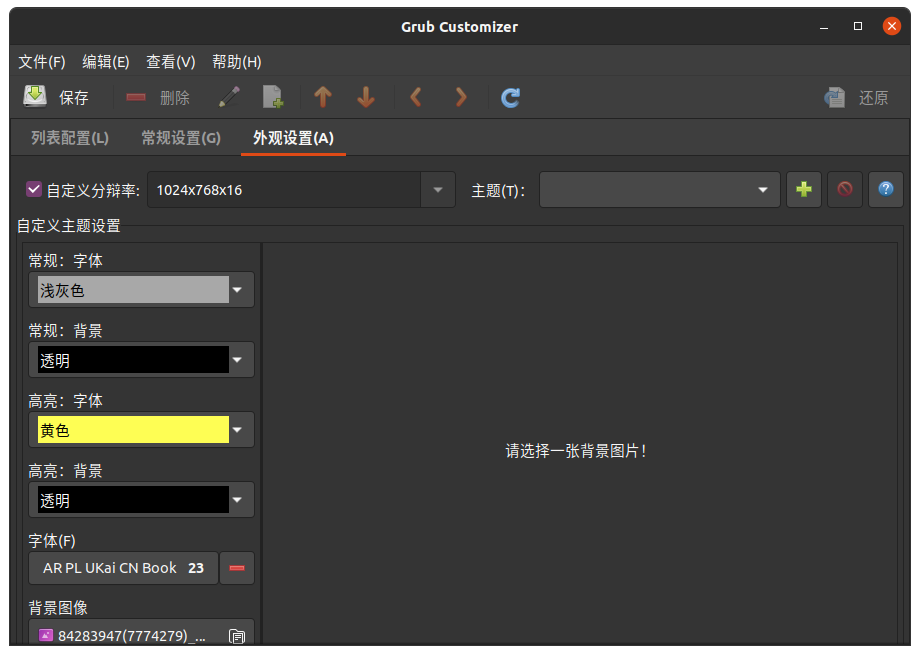

## 目录

<!-- TOC depthFrom:2 -->

- [关于Ubuntu20.04.2提示无法提供完整语言支持解决办法](#关于ubuntu20.04.2提示无法提供完整语言支持解决办法)
- [Ubuntu与Windows重复启动，启动项套娃](#ubuntu与windows重复启动，启动项套娃)

<!-- /TOC -->


# 关于Ubuntu20.04.2提示无法提供完整语言支持解决办法

确定下载文件后提示依赖关系不正确
看了很多教程都没什么用，作为Ubuntu的小白，尝试打开终端按照在提示下载页中展开详细，逐个apt安装，发现是前缀为libreoffice的软件的报错，而且用sudo apt-get -f install liberoffice提示无法修正，原因是apt中的libreoffice为6.4.7，版本过于古老，目前最新版本为7.2


## 解决方法：

### 安装libreoffice

找对方向后在[Libreoffice官方国内镜像下载](https://mirrors.cloud.tencent.com/libreoffice/libreoffice/stable/)下载对应想安装的版本，这里我选择了[7.2.0/deb/x86_64](https://mirrors.cloud.tencent.com/libreoffice/libreoffice/stable/7.2.0/deb/x86_64/)，下载3个文件：[LibreOffice_7.2.0_Linux_x86-64_deb.tar.gz](https://mirrors.cloud.tencent.com/libreoffice/libreoffice/stable/7.2.0/deb/x86_64/LibreOffice_7.2.0_Linux_x86-64_deb.tar.gz),[LibreOffice_7.2.0_Linux_x86-64_deb_helppack_zh-CN.tar.gz](https://mirrors.cloud.tencent.com/libreoffice/libreoffice/stable/7.2.0/deb/x86_64/LibreOffice_7.2.0_Linux_x86-64_deb_helppack_zh-CN.tar.gz),[LibreOffice_7.2.0_Linux_x86-64_deb_langpack_zh-CN.tar.gz](https://mirrors.cloud.tencent.com/libreoffice/libreoffice/stable/7.2.0/deb/x86_64/LibreOffice_7.2.0_Linux_x86-64_deb_langpack_zh-CN.tar.gz)
然后解压

或者在终端输入代码：

> wget -c https://mirrors.cloud.tencent.com/libreoffice/libreoffice/stable/7.2.0/deb/x86_64/LibreOffice_7.2.0_Linux_x86-64_deb.tar.gz
> wget -c https://mirrors.cloud.tencent.com/libreoffice/libreoffice/stable/7.2.0/deb/x86_64/LibreOffice_7.2.0_Linux_x86-64_deb_helppack_zh-CN.tar.gz
> wget -c https://mirrors.cloud.tencent.com/libreoffice/libreoffice/stable/7.2.0/deb/x86_64/LibreOffice_7.2.0_Linux_x86-64_deb_langpack_zh-CN.tar.gz
>
> tar -xvf  LibreOffice_7.2.0_Linux_x86-64_deb.tar.gz  #解压指令具体没使用，作为小白还是用归档管理器友好
> tar -xvf LibreOffice_7.2.0_Linux_x86-64_deb_helppack_zh-CN.tar.gz
> tar -xvf LibreOffice_7.2.0_Linux_x86-64_deb_langpack_zh-CN.tar.gz 

鉴于前文原因，我直接双击进解压后目录进入DEBS文件夹内打开终端
> sudo dpkg -i ./*.deb

安装对应文件顺序应先安装libreoffice主体，然后再安装helppack和langpack对应中文离线帮助文档和语言包

### 卸载libreoffice6.4.7

懂正则的可以用命令卸载旧版，可以试试用sudo apt-get remover --purge libreoffice6.4.7-* 。这里我用synaptic图形界面卸载，搜索libreoffice，在搜索结果中逐个把版本为6.4.7的软件全部右键标记彻底删除，最后点击应用，这时就会自动应用更改，可能还会有卸载残余，继续标记彻底删除应用即可
可以退出synaptic在终端使用apt-get autoremove移除不再需要的软件包。

### 安装语言文件

但是这时只是排除了由于libreoffice版本老的报错，语言支持还不完整，再次打开语言支持，确认安装，如果说权限不足，那就用开头办法，退出再打开一次，查看详情在终端用sudo apt-get install逐个安装对应语言文件，然后再次打开就不会提示。

## 更好的解决方法

首先卸载原来的libreoffice

> sudo apt-get remove --purge libreoffice*

然后按照上面做法下载7.2版本安装，最后安装系统语言文件


# Ubuntu与Windows重复启动，启动项套娃
## 问题分析
我电脑在Windows10基础上安装Ubuntu后没有出现Grub而是直接进入Windows，于是用EasyBCD修改BCD启动项内容，[添加Ubuntu启动项](https://jingyan.baidu.com/article/da1091fb7dc94b027849d62b.html)，这时由于Grub没有写进MBR，所以自动进入的是Windows Boot Manager。修改完BCD后重启这时会出现Windows10与Ubuntu的启动项，如果选择Ubuntu启动就会出现Grub，这时依然可以选择进入Windows10重新进入Windows Boot Manager，于是出现了套娃现象，解决办法很简单，直接把Grub安装到MBR，然后再进入Windows把BCD中Ubuntu启动项删除，等待时间设成0，这样就能只用Grub引导一次分别可以进入Ubuntu与Windows

## 将Grub安装到MBR
### 安装grub-customizer
首先进入Ubuntu系统，如果不能进入的参考[使用easyBCD 引导启动ubuntu](https://jingyan.baidu.com/article/da1091fb7dc94b027849d62b.html)，打开终端执行：
```shell
$ sudo apt-get update
$ sudo apt-get install grub-customizer
```

如果Ubuntu版本过老则可以从[官网5.1.0下载](https://launchpad.net/grub-customizer/5.1/5.1.0/+download/grub-customizer_5.1.0.tar.gz)，[官网地址](https://launchpad.net/grub-customizer/)，按照压缩包内README从源码编译：

```bash
$ sudo apt-get update
$ sudo apt-get install cmake gettext g++ libgtkmm-3.0-dev libssl-dev libarchive-dev
$ tar zxvf grub-customzier_5.1.0.tar.gz       #exctact grub-customizer_5.1.0.tar.gz
$ cmake . && make
$ sudo make install
```
### 打开Grub-customizer
等待一会加载

这里可以添加启动项，改名称，按菜单的上下箭头调整顺序

### 安装到MBR
菜单的文件选项里有安装到MBR的选项，直接安装就好了

### 其他设置
还能改Grub默认显示时间等


外观设置中可以设置字体、大小、背景图片等

修改完记得点保存，重启之后就默认由Grub引导了

## 修改BCD
重新进入Windows后可以用EasyBCD修改BCD，删除Ubuntu启动项或等待时间设成0

## 结
这样就能只由Grub引导而不出现Windows Boot Manager

或者可以把Grub等待时间设成0，就不用把grub安装到MBR，不过不建议这样做
